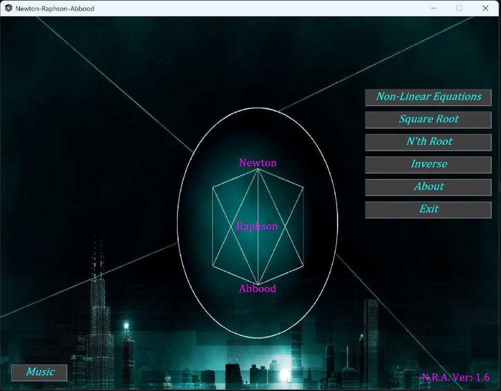
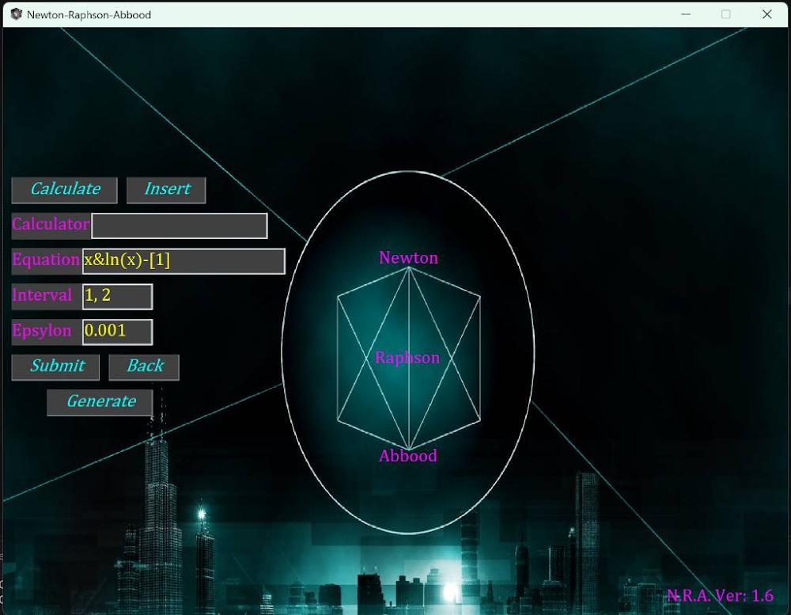
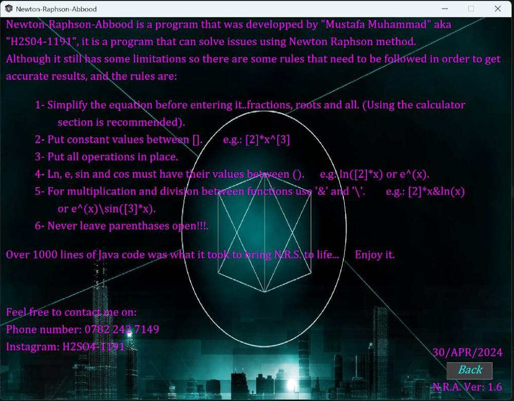
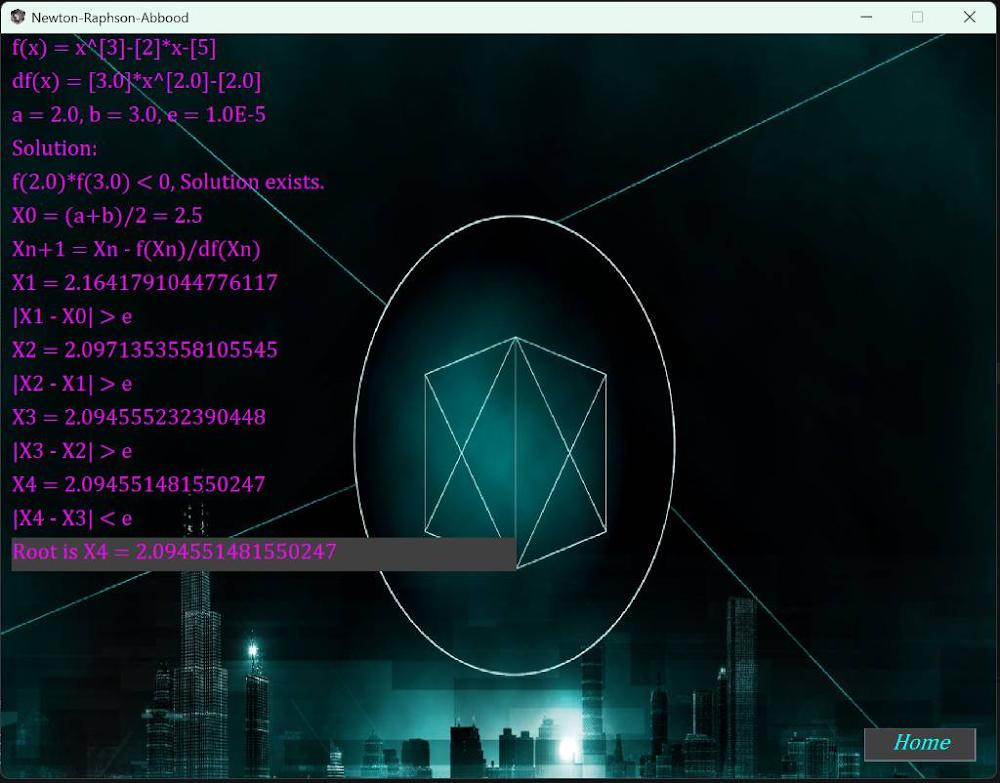

# Newton-Raphson-Abbood

A specialized desktop numerical analysis calculator built in Java to solve non-linear mathematical equations, root-finding operations, and function approximations using the Newton-Raphson method.

## Overview

**Newton-Raphson-Abbood** is a custom desktop application engineered to compute the real roots of non-linear functions step-by-step. Spanning across a modular architecture, the system implements an internal analytical derivative parser framework (`f.java`) to dynamically derive equations (\(df(x)\)) directly from user string input. The interface is uniquely designed to mimic a classic video game main menu, complete with ambient 8-bit background music switches and a deep cyberpunk aesthetic wrapping its rigorous computational modules.

## Features

- **Comprehensive Mathematical Core:** Supports all functional applications of the Newton-Raphson methodology, including specialized tracking routes for Non-Linear Equations, Square Roots, \(N\)-th Roots, and Function Inverses.
- **Dynamic Analytical Derivative Engine:** Built natively with custom equation handlers (`f.java`) that interpret multi-variable mathematical expressions and calculate exact mathematical derivatives dynamically without hardcoding formulas.
- **Strict String Expression Parser:** Implements specialized syntax token limits for robust parsing stability:
  - **Encapsulated Constants:** Numerical coefficients must be explicitly wrapped in brackets (e.g., `[2]*x^[3]`).
  - **Strict Function Bounds:** System methods like logarithmic or trigonometric limits require explicit parameter parentheses grouping (e.g., `ln([2]*x)` or `e^(x)`).
  - **Explicit Binding Operations:** Leverages specialized multi-variable logic markers like `&` for multiplication and `\` for operational divisions across formulas.
- **Detailed Solution Verification:** Validates initial mathematical boundaries via Intermediate Value Theorem bounds (\(f(a) \cdot f(b) < 0\)) before running full recursive convergence cycles (\(X\_{n+1} = X_n - \frac{f(X_n)}{f'(X_n)}\)) down to strict epsilon error thresholds (\(\epsilon\)).
- **Video Game Styled Dashboard:** Implements retro cyber UI design components including neon font matrices, a modular sidebar select options layout, and background music player control tracks.

## Tech Stack

- **Language:** Java (JDK 8 or higher)
- **UI Toolkit:** Native Java Swing / AWT custom layout modifications
- **Architecture Profile:** Object-Oriented component architecture splitting custom layout buttons, panels, labels, and formulas.

## Project Structure

```bash
newton-raphson-abbood/
├── Gadgets/                   # Ancillary layout configuration dependencies
├── screenshots/               # Interface preview files for portfolio documentation
│   ├── about.jpg              # Program guide and parsing syntax index
│   ├── home.jpg               # Video-game styled main configuration menu
│   ├── input.jpg              # Equation and interval parameters input portal
│   └── output.jpg             # Recursive convergence logging panel trace
├── src/                       # Java codebase development source tree
│   ├── Box.java               # Custom design container component wrapping fields
│   ├── Button.java            # Interactive modular menu action button layout
│   ├── f.java                 # Core mathematical evaluator and derivative calculator engine
│   ├── Frame.java             # Main application window framework constructor
│   ├── Label.java             # Styled text wrapper with custom neon parameters
│   ├── Main.java              # Primary orchestration entry portal running system states
│   └── Panel.java             # Graphic canvas manager rendering view changes
└── .gitignore                 # Excludes local IDE caches and transient compiled targets
```

## Application Interface Mappings

### Main Control Dashboard & Variable Input

 

_Figure 1: Cyberpunk-inspired video game menu layout alongside dynamic algebraic interval entries and precision controls._

### Expression Verification Rules & Convergence Trailing

 

_Figure 2: Custom parameter input specifications index alongside active runtime logs tracking step-by-step root convergence bounds._

## Installation & Execution

### Prerequisites

- Java Development Kit (JDK) 8 or higher initialized in system environment parameters.
- Graphical environment support layer capable of handling native window panels.

### Compilation Guide

- Clone this operational code package layout down to your computer environment:

  ```bash
  git clone https://github.com
  ```

- Navigate straight into the project development source tree folder:

  ```bash
  cd newton-raphson-abbood/src
  ```

- Build and compile all component source codes simultaneously via the console tool:

  ```bash
  javac *.java
  ```

- Execute the main orchestration class file layer to spin up the tool calculator:
  ```bash
  java Main
  ```

## Author

H2SO4-1191 – Software Engineer
